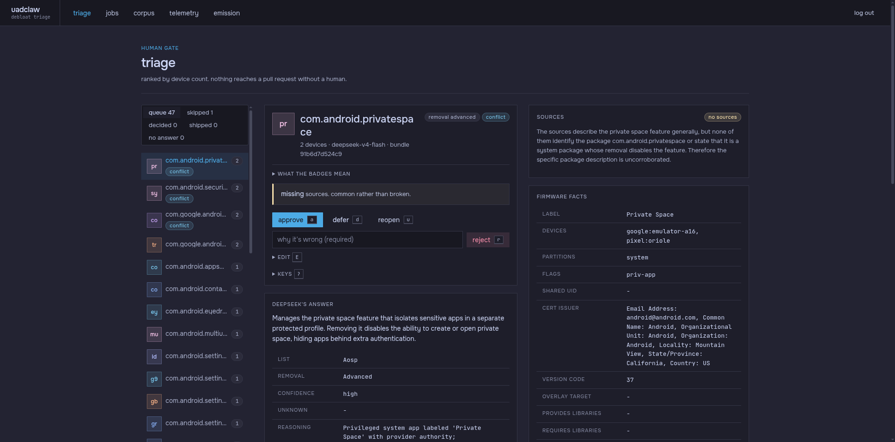

<div align="center">

# uadclaw

**Automatic LLM-driven bloat classification of Android apps, from official OEM firmware to a reviewed UAD-ng pull request.**

A FastAPI dashboard drives a worker through ten pipeline stages, and a human approves every package before it ships upstream.

[](#license)
[](.github/workflows/ci.yml)

</div>

---

uadclaw pulls official OEM firmware and extracts its preinstalled APKs. A named list waives the appless partitions (`*_dlkm` kernel-module images, filesystems like `userdata`), never silently. It derives what it can deterministically and classifies the rest with DeepSeek. Every candidate goes through a human gate before it becomes a pull request to [UAD-ng](https://github.com/Universal-Debloater-Alliance/universal-android-debloater-next-generation). Spend is deliberate: the deterministic half never touches a paid API, and the model can only raise a rating above a computed floor.



## Why

- **Deterministic first, model last.** acquire through rule_ladder read the firmware bytes and the manifests. DeepSeek writes the description and proposes a removal; `dependencies` and `neededBy` never come from the model. Every field carries its provenance: `rule:`, `graph:`, `llm:`, `human:`.
- **The rule ladder sets a floor the model can raise, never lower.** `coreApp`, `priv-app`, `sharedUserId` and friends pin a danger tier. A below-floor answer is rejected, never clamped.
- **LLM spend is a separate job, never an automatic step.** A firmware job ends at the rule ladder. A human queues the classification job that pays the API.
- **Every model answer faces an external check.** A Brave search and a judge pass look for independent support. A citation the judge was never handed refuses the whole response.
- **The evidence bundle is the reproducibility anchor.** It is content-addressed and pinned, because DeepSeek has no seed. The same bundle hash means the same question.
- **Nothing pushes itself.** Approved entries are appended to a local branch with the disclosure upstream requires. A human pushes and opens the PR.

## How it works

| stage | what happens |
|---|---|
| acquire | one driver per OEM pulls the newest firmware for the models the operator names |
| unpack | dispatch on container-format magic numbers; ext4 via 7z, EROFS via fsck.erofs, Samsung `.enc4` decrypted in the driver |
| extract facts | androguard reads each APK manifest into typed facts, merged across devices by package name |
| corpus graph | two dependency edge classes only: overlay-to-target and required-library provider to consumer |
| filter | drops what is already in `uad_lists.json`, auto-generated RROs, and emulator-only packages |
| rule ladder | the removal floor from manifest and `/etc` signals; the model may raise it, never lower it |
| llm | DeepSeek writes the description and proposes a removal; below-floor answers are rejected |
| corroborate | Brave search plus a judge pass; a fabricated citation refuses the whole response |
| triage | keyboard-driven human gate, ranked by device count; decisions land in an append-only log |
| branch | approved entries are appended to the operator's clone of upstream; the PR body carries the disclosure |

The worker runs firmware jobs through acquire to rule_ladder. Classification (llm, corroborate) and branch emission are separate job kinds a human queues.

## Install

The stack is Docker Compose: Postgres, the web dashboard, and a worker. Credentials are files under `secrets/`, mounted as docker secrets.

```sh
git clone https://github.com/uwuclxdy/uadclaw
cd uadclaw
uv sync --frozen
cp .env.example .env          # for from-source runs; compose reads secrets/ instead
mkdir -p secrets
printf 'a long random postgres password' > secrets/postgres_password
printf 'a long random login password'    > secrets/auth_password
printf 'a long random session secret'    > secrets/session_secret
touch secrets/deepseek_key               # blank is fine; the file must exist
touch secrets/brave_key                  # blank is fine; the file must exist
docker compose up -d --wait postgres
docker compose run --rm web alembic upgrade head
docker compose up -d
```

The dashboard is at http://localhost:8000. Login is the single `AUTH_PASSWORD`. `secrets/deepseek_key` and `secrets/brave_key` are blank by default: the file must exist, an empty file is fine, and the install block creates them. Blank content fails only the paid stages, at the point of use, never at startup.

> [!NOTE]
> The worker bind-mounts a scratch dir for multi-GB firmware unpack and, for branch emission, the operator's clone of upstream. Defaults are in docker-compose.yml with their one-time setup steps. For a quick local run, point `WORKER_SCRATCH_DIR` at a writable directory.

## Usage

Everything runs from the dashboard.

1. Queue a firmware job: pick a driver and a device, watch the stages on the jobs screen.
2. Queue a classification job when the firmware work is done. This is the paid step.
3. Work the triage queue. Each card shows the evidence, the model proposal, the corroboration sources, the floor, and the nearest upstream entries.
4. Run a branch emission for one vendor batch. The PR body is on the emission row. Push the branch and open the PR by hand.

Refresh `data/uad_lists.json` deliberately when you want the filter to know what is new upstream:

```sh
mkdir -p data && curl -fsSL -o data/uad_lists.json https://raw.githubusercontent.com/Universal-Debloater-Alliance/universal-android-debloater-next-generation/main/resources/assets/uad_lists.json
```

## Configuration

Settings load from mounted docker secrets first, then the environment, then `.env`. Blank credentials refuse to start the app.

| setting | default | what it does |
|---|---|---|
| `POSTGRES_PASSWORD`, `AUTH_PASSWORD`, `SESSION_SECRET` | required | the three credentials; mounted as files under `secrets/` |
| `PIXEL_TERMS_ACK_COOKIE_VALUE` | unset | accepts Google's factory-image terms; the Pixel driver refuses to fetch without it |
| `SAMSUNG_MODELS` / `SAMSUNG_REGIONS` | unset | the model by CSC grid the Samsung driver probes |
| `MOTOROLA_DEVICES` | unset | the codenames the Motorola driver crawls |
| `DEEPSEEK_KEY` | unset | the classification key; refused at the first call, not at startup |
| `BRAVE_KEY` | unset | the corroboration key; blank means a classification job ends at corroborate |
| `UPSTREAM_REPO_PATH` | unset | the operator's clone the emission commits into |
| `PIPELINE_COMMIT_SHA` | unset | the commit of this pipeline; branch emission refuses without it |
| `WORKER_SCRATCH_DIR` | `/mnt/ssd-1/scratch` | host directory for firmware unpack |

<details>
<summary>Full settings reference</summary>

The first-touch keys are all in the table above: the three credentials, `PIXEL_TERMS_ACK_COOKIE_VALUE`, `SAMSUNG_MODELS`/`SAMSUNG_REGIONS`, `MOTOROLA_DEVICES`, `DEEPSEEK_KEY`, `BRAVE_KEY`, `UPSTREAM_REPO_PATH`, `PIPELINE_COMMIT_SHA` and `WORKER_SCRATCH_DIR`. The complete schema, defaults and comments included, lives in `src/uadclaw/settings.py` and `.env.example`.

</details>

## Comparison

| | uadclaw | hand-curated UAD list | bare LLM over package names |
|---|---|---|---|
| evidence per package | manifest facts, firmware graph, one pinned bundle | maintainer memory | the name |
| safety floor | rule ladder; unrepresentable to lower | maintainer judgement | none |
| external check | search plus judge; fabricated citations refused | none | none |
| human gate | keyboard triage, every package | the maintainer, every entry | none |
| what reaches upstream | append-only insertion with disclosure | direct edits | whatever the model said |

## FAQ

**What does uadclaw classify?** The preinstalled APKs of official OEM firmware, minus the partitions a named list waives as appless, for the Universal Android Debloater list.

**Which phones does it support?** Pixel, Xiaomi, Nothing, Motorola, Samsung and Oppo/OnePlus/realme. One driver each, and unpack dispatches on bytes, never on the OEM.

**Does the model decide what gets removed?** No. The rule ladder sets a floor, the model proposes, and a human approves in triage. A below-floor answer is rejected, not clamped.

**Does uadclaw push to upstream?** No. It commits a local branch and renders the PR body. A human pushes and opens the PR.

**What does it cost to run?** DeepSeek and Brave tokens for the two paid stages. The deterministic half needs no paid keys at all.

## Development

```sh
uv sync --frozen
docker compose up -d --wait postgres   # test Postgres on 127.0.0.1:55432
uv run ruff check
uv run ruff format --check
uv run pytest
```

The suite needs a real Postgres: the override publishes loopback port 55432, and DB-backed tests fail loudly, not skip, when nothing is reachable. That override is gitignored, so a fresh clone lacks it: copy `docker-compose.override.yml` from a checkout that has one, or recreate it locally. The suite creates one isolated database per pytest-xdist worker and migrates it with alembic itself. Heavy tests that run the real extraction chain against a multi-GB image need `UADCLAW_HEAVY_TESTS=1`. Run the app from source with `uv run uvicorn uadclaw.asgi:app` and a Postgres reachable at your `.env` coordinates.

## Documentation

The design doc and the domain knowledge live in `docs/` locally; they are gitignored by design, so a checkout never carries them. `src/uadclaw/settings.py` and `.env.example` are the committed configuration reference. Issues and PRs are welcome; [CONTRIBUTING](.github/CONTRIBUTING.md) has the rules, agent formats included.

## License

MIT, see [LICENSE](LICENSE).
